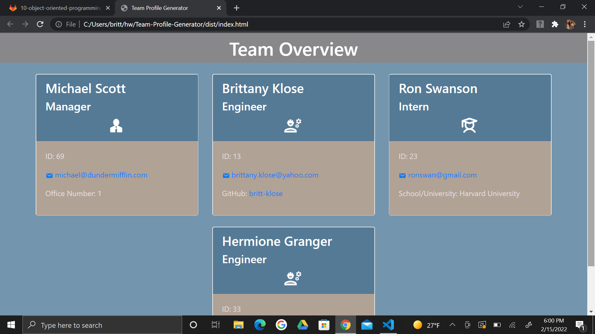
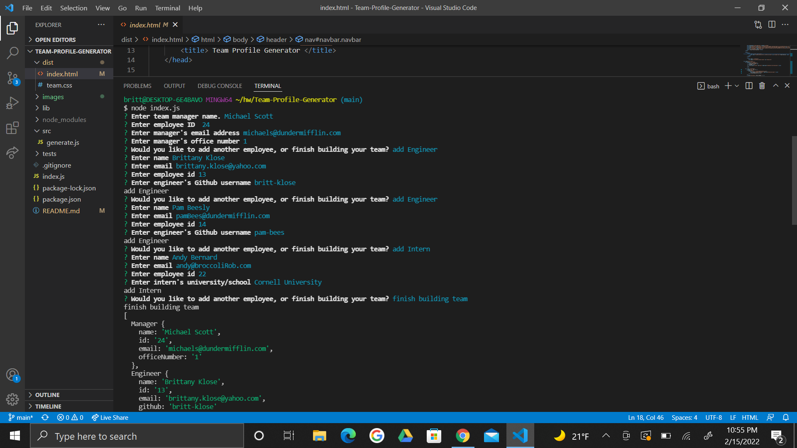

# Team-Profile-Generator

  ## Description
This application generates a rooster of team member profiles. Users run node index.js in the terminal and input in details (such as name and email) for the team manager and any employees on the team. When finished building their team, an html document will be generated inside the 'dist' folder with all the employees' info. The user then can open the html document in their browser and see all the information organized into cards. 

  ## Table of Contents

* [Installation](#installation)
* [Usage](#usage)
* [License](#license)
* [Contributing](#contributing)
* [Tests](#tests)
* [Questions](#questions)

## Installation
To install this application go through the following steps. 
1. Open or clone the repository to VSC. 
2. Open terminal in VSC run npm init -y to initialize 
3. Make sure you have inquirer downloaded. In the terminal run npm install inquirer. 
4. Need to install Jest. In terminal run npm i jest
5. Run node index.js to begin. Then input team profile details.

## Usage
While running node index.js in the terminal users will be prompted to input the details of each team member. First it will ask for all the information about the team manager. For example, if the prompt asks the user to enter the name of the manager. Type in their name and hit enter. Then users will be asked to add another employee or to finish their team. If they want to add another member they can either pick to add an engineer or and intern. Once one is picked they will be asked to input details for that employee. Then they will be brought back to the main menu again to either finish the team or keep adding employees. When they are done adding members they will hit finished building team. The terminal will show all the inputs entered and the user can then view their generated html page. Visual examples and a video demo can be seen below for more help. 
 
 

Demo:https://drive.google.com/file/d/1RHcetlh4kK_cuEdhCoqpMIUx96VB2d0Y/view

## License
This application uses the ISC license 

## Contributing
If you are looking to add a contribution to this project you can visit this site for information: [Contributor Covenant](https://www.contributor-covenant.org/)

## Tests
There are currently four tests on this application that you can run. All are located under the 'tests' folder and titled accordingly. Open your terminal and type in npm test, or npm run test and all should run and show what is working or not working.

## Questions

For any additional questions or issues, you can reach out to me 
via email at brittany.klose@yahoo.com
Otheriwise fee free to further view my work on my github page at [britt-klose](https://github.com/britt-klose/).